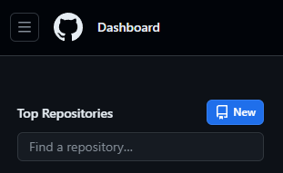
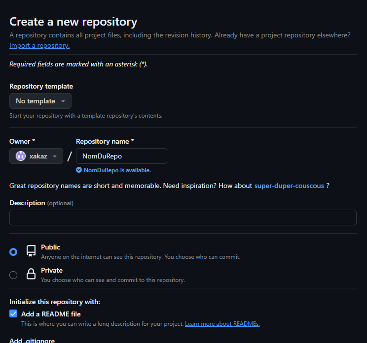
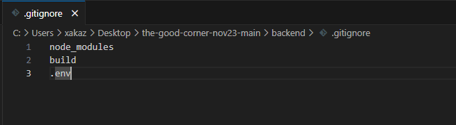
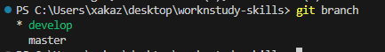
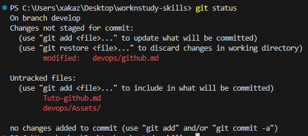
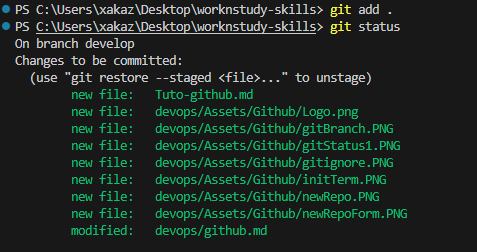
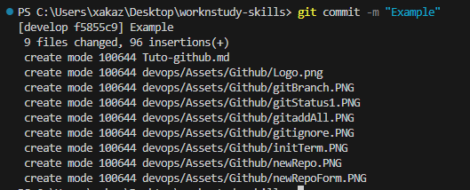

# Gestion d'un projet avec Git et Github  

## Création du repo
Après avoir créer un compte sur github, je peux créer un repo, c'est un dépôt distant de l'application que je souhaite développer.    
Pour créer un repo sur github, je clique sur le bouton New :  


  
Ensuite je remplis le formulaire :  



Une fois que mon repo est créé sur github, dans un terminal, j'initialise mon repo en local puis je le lie au repo distant:
```
git init
git remote add origin https://github.com/monPseudoGithub/NomDuRepo.git
```  

  
## Gestion du repo
  
Il vaut mieux ne pas tout partager sur github, soit à cause de la taille de l'élément, soit pour des raisons de confidentialité.  
Dans ce cas on utilise un fichier ".gitignore" dans lequel on liste les éléments que l'on ne désire pas partager.  



Lors du developpement, je vais devoir régulièrement envoyer mon travail sur le repo distant.  
Pour cela je dois dans un premier temps ajouter mes modifications, puis réaliser un commit.
```
git add .
ou
git add nomDuFichier.extension
```
Ces commandes permettent d'ajouter les fichiers voulus à une liste d'attente avant le commit.  
Le commit va grouper toutes les modifications qui correspondent à une version:  
```
git commit -m "nom du commit"
```  
Une fois le commit effectué, on envoie les modifications sur le repo distant.
```
git push
```  
  

## Gestion des branches
Lorsque qu'un projet est déployé et que l'on souhaite ajouter des nouvelles fonctionnalités, ou lorsqu'on travaille en équipe et qu'on ne veut ni impacter le travail de ses collègues, ni être impacté par le leur, on utilise les **branches**.
En effet les branches permettent de développer ce que l'on veut sans avoir à se soucier des effets de bord immédiats pendant la phase de développement.  
  
Pour créer une branche, la bonne pratique est de nommer en kebab-case:
```
git branch nom-de-la-branche    // création de la branche
git checkout nom-de-la-branche  // positionnement sur la branche
```
Le projet est positionné sur la branche créée grâce à ce raccourci qui regroupe les 2 étapes précédentes:
```
git checkout -b nom-de-la-branche
```
Afin d'envoyer notre branche sur le dépôt distant, on effectuera la commande suivante:  
```
git push --set-upstream origin nom-de-la-branche
```

Si on désire changer de branche, on peut, dans un premier temps, visualiser les différentes branches:  
```
git branch
```
_Exemple dans le terminal de VSCode :_  

  

On peut voir 2 branches:
- develop
- master  

L'étoile à côté de dévelop nous indique la branche sur laquelle on se trouve.  
Dans ce cas, si l'on souhaite retourner su la branche master :  
```
git checkout master
```

## Gestion des commits  
Pour connaître l'état de notre branche actuelle, on utilise la commande:
```
git status
```
  

Ci dessus, nous pouvons voir qu'aucun fichier modifié n'a été ajouté à l'index, et de ce fait aucun commit n'est possible. Je vais donc ajouter les fichiers modifiés grâce à la commande "git add .".  

  

En vert nous pouvons voir les différents fichiers prêts pour le commit.  
Si je tape la commande:
```
git restore --stage devops/github.md
```
Le fichier sera supprimé de la liste et ne sera pas intégré au commit.  

  

Je peux donc faire un commit de mes modifications:
```
git commit -m "Example"
```
  

## Gestion des pull-request
