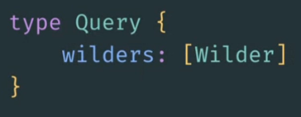
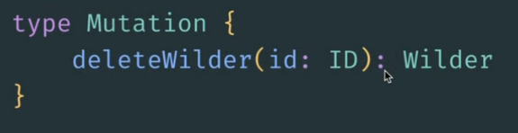
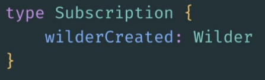

 
# GraphQL

> ❌ A travailler

> ✔️ Auto validation par l'étudiant

## 🎓 J'ai compris et je peux expliquer

- la différence entre REST et GraphQL ✔️
    ### REST
    _REST_ est une convention qui définit un ensemble de règles visant à créer un service web ou une application.  Les inconvénients de _REST_ sont peu nombreux mais conséquents :

    - ***Overfecthing*** (_trop de datas_)  
    On récupère souvent plus de données que celles qu'on va réellement utiliser. 

    - ***Underfecthing*** (_multiplication des appels_)  
    On ne récupère pas assez de données. Chaque endpoint renvoie ses propres ressources, on devra faire plusieurs requêtes pour récupérer ce dont on a besoin.  

    - ***Typage***  
    On ne connaît pas les types des données à l'avance. On doit les récupérer pour connaître leurs types.
  
    > ***Impact Négatif*** sur les performances (_temps de chargement, affichage_) et le coût (_ressources serveurs, cpu, ram_) de l'application.
    ###
      
    ### GRAPHQL
    _GRAPHQL_ n'est pas orienté document, il est orienté **demandes** :

    - ***YouGetWhatYouNeed***  
    On récupère uniquement les données qu'on va réellement utiliser. La réponse dépend de ce qu'on demande dans la requête.  

    - ***Un seul endpoint*** (_point d'entrée_)   
    Quelques soient les données à récupérer, un seul appel précis nous permettra de récupérer ce dont on a besoin. **Ni plus, ni moins**.  

    - ***Typage***  
    On connaît les types des données à l'avance car GraphQL nous renvoie exactement la même structure de données qu'on lui soumet dans la requête.

    > ***Impact Positif*** sur les performances et le coût de l'application.
    ###  

- les besoins auxquels répond GraphQL ❌ / ✔️  

- la définition d'un schéma ✔️
Le schema est un document qui contient tous les types présents sur l'API. Il est écrit en SDL (schema definition Language )

- Query ✔️  
    Points d'entrée en lecture de l'API.  
      
    _Ici on répère un tableau de Wilders_  
    
- Mutation ✔️  
    Points d'entrée en écriture (_création, modification, suppression_) de l'API.  
      
    _Ici on supprime un Wilder grâce à son id passé en paramètre de la méthode deleteWilder_  
    _Le wilder supprimé est retourné par la méthode_  

- Subscription ❌ / ✔️
    Le serveur peut initier la communication. C'est utilisé pour faire des applications en temps réel type messagerie.  
      

## 💻 J'utilise

### Un exemple personnel commenté ❌ / ✔️

### Utilisation dans un projet ❌ / ✔️

[lien github](...)

Description :

### Utilisation en production si applicable❌ / ✔️

[lien du projet](...)

Description :

### Utilisation en environement professionnel ❌ / ✔️

Description :

## 🌐 J'utilise des ressources

### Titre

- lien
- description

## 🚧 Je franchis les obstacles

### Point de blocage ❌ / ✔️

Description:

Plan d'action : (à valider par le formateur)

- action 1 ❌ / ✔️
- action 2 ❌ / ✔️
- ...

Résolution :

## 📽️ J'en fais la démonstration

- J'ai ecrit un [tutoriel](...) ❌ / ✔️
- J'ai fait une [présentation](...) ❌ / ✔️
